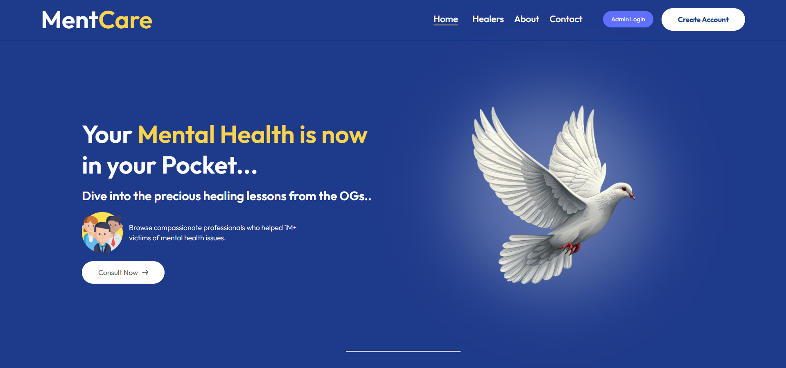
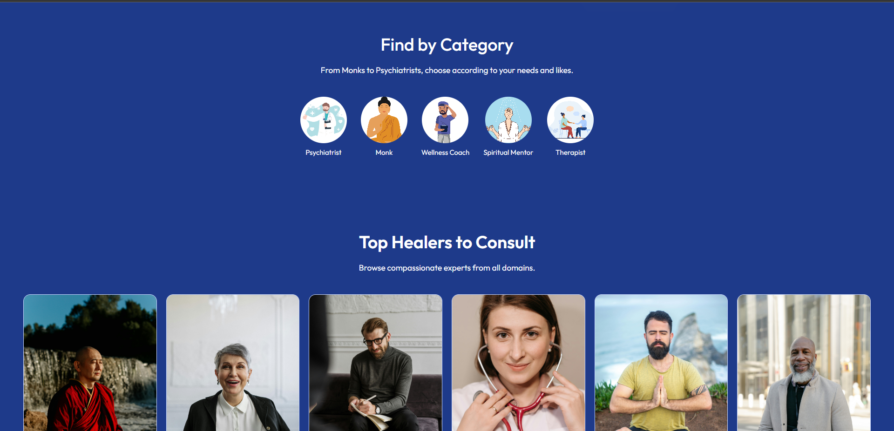
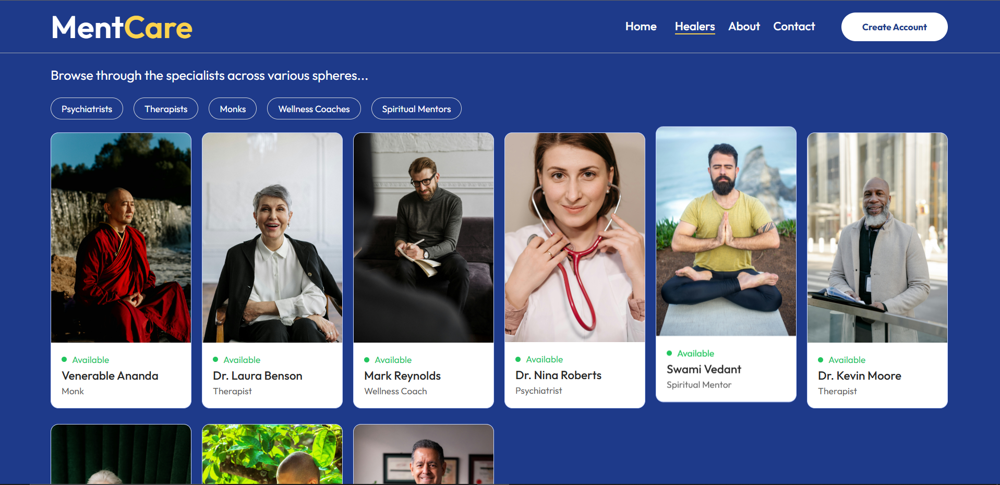
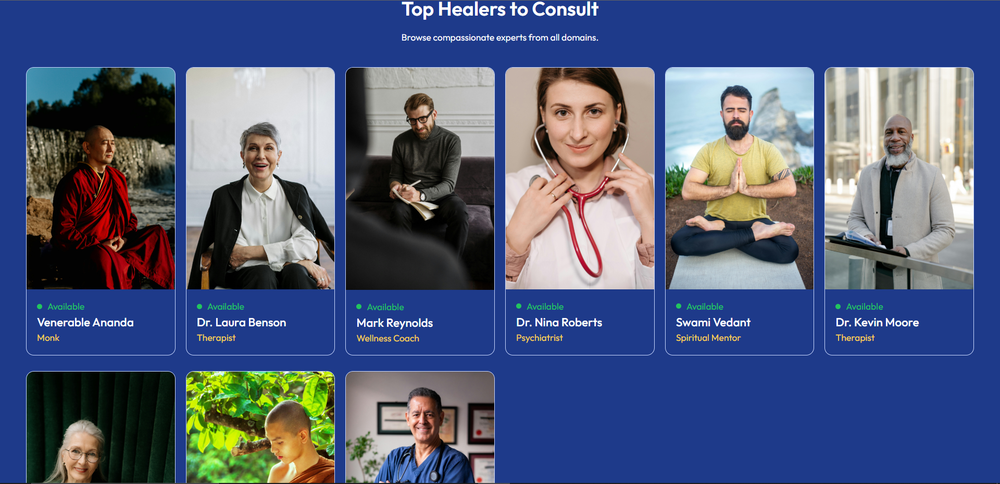
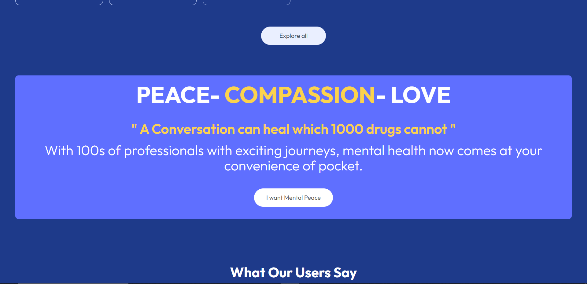
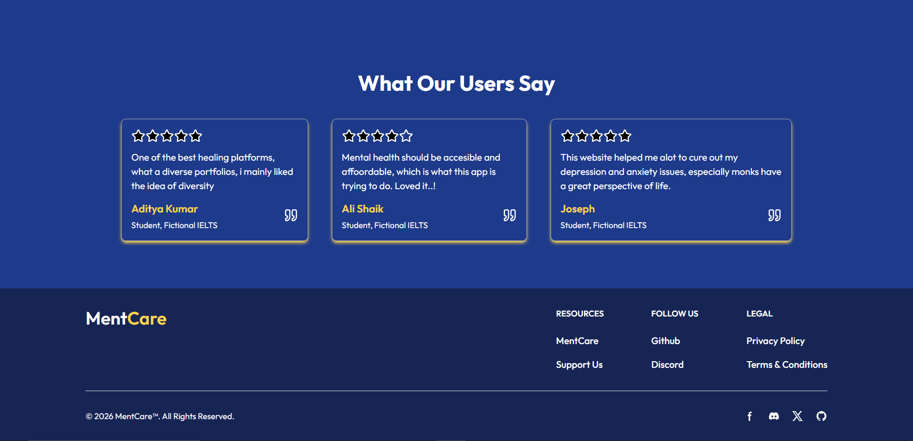
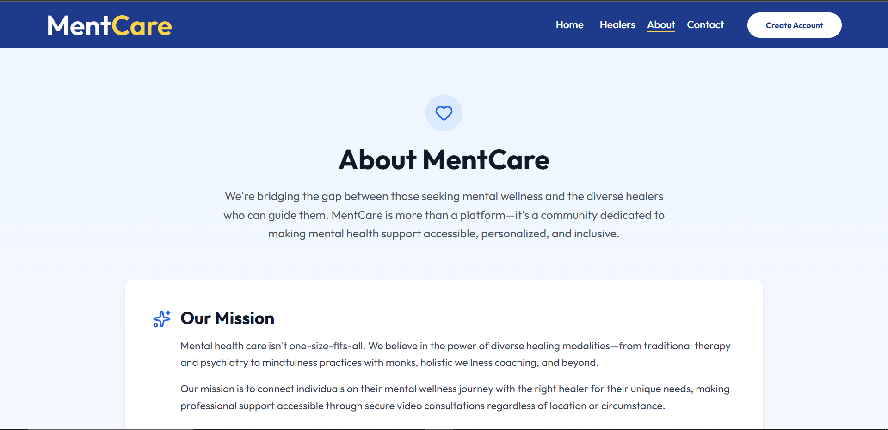

# 🧠 MentCare – Holistic & Accessible Mental Health Platform

MentCare is a **full-stack MERN web application** built to make mental health support **accessible, inclusive, and stigma-free** through online consultations.  
The platform connects users with professionals from **multiple healing disciplines**, enabling a truly **holistic approach to mental well-being**.

---

## 🌍 Why MentCare?

Mental health challenges such as **stress, anxiety, burnout, and emotional imbalance** affect a significant percentage of:
- Students  
- Working professionals  
- Individuals across all age groups  

Despite this, many people continue to struggle **without professional support** due to:
- Lack of companionship
- Limited access to therapy
- High costs
- Social stigma

MentCare was created to **bridge this gap** by offering **easy-to-access online consultations** with trusted professionals, helping users seek support **without barriers**.

### 🌱 A Holistic Healing Ecosystem

Unlike traditional platforms, MentCare embraces **inclusive healing** by bringing together experts from various domains:

- 👨‍⚕️ Medical Doctors  
- 🧠 Therapists & Counselors  
- 🧘 Wellness & Life Coaches  
- 🧘 Spiritual Mentors & Monks  

This ensures users can choose the **healing path that aligns best with their needs and beliefs**.

---

## ✨ Key Features

- 🔐 **Secure Authentication & Authorization**
  - JWT-based login system
- 👥 **Role-Based Access Control**
  - Separate dashboards for **Admin** and **Users**
- 📅 Online consultation booking
- 💳 **Integrated Payments**
  - Razorpay & Stripe for secure transactions
- ☁️ Media uploads using **Cloudinary**
- 🎨 Smooth UI animations with **Framer Motion**
- 📱 **Fully Responsive Design**
  - Optimized for **mobile, tablet, and desktop**
- ⚡ Fast performance with **Vite + React 18**

---

## 📱 Responsive Design

MentCare is built with a **mobile-first approach**, ensuring a seamless experience across all screen sizes:

- 📱 Smartphones
- 📟 Tablets
- 💻 Laptops & Desktops

Tailwind CSS utilities and flexible layouts ensure **consistent UI/UX** on every device.

---

## 🛠️ Tech Stack

### Frontend
- React 18
- Vite
- JavaScript
- Tailwind CSS
- Axios
- React Router
- Framer Motion

### Backend
- Node.js
- Express.js
- MongoDB
- Mongoose
- JWT Authentication
- Multer
- Cloudinary

### Payments
- Razorpay
- Stripe

### Deployment & Services
- Vercel
- MongoDB Atlas
- Cloudinary

---

## 🖼️ Screenshots

> *(Screenshots taken from the live application and placed in the `/screenshots` directory)*

### 🏠 Home Page


###  Scroll 


### 👨‍⚕️ Professionals Listing


### Top Healers


### 🛠 Banner


### Testimonials


### About


### 📱 Mobile Responsive View


---

## 🚀 Getting Started

### Prerequisites
- Node.js
- MongoDB
- Cloudinary Account
- Razorpay / Stripe Account

---

### Installation

```bash
git clone https://github.com/your-username/mentcare.git
cd mentcare


